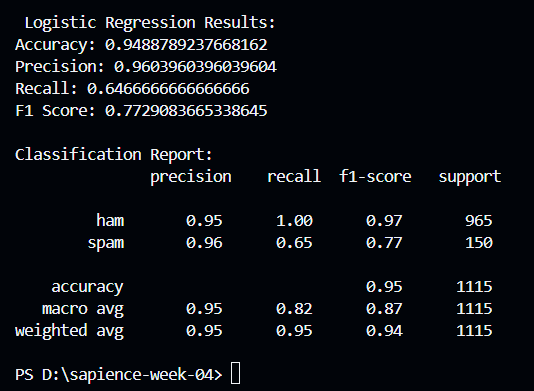

# 📱 SMS Spam Detection using Deep Learning

This project is part of my AI/ML internship at **Sapience**. It implements an NLP-based SMS Spam Detection system using a neural network (Keras Sequential API). The model classifies SMS messages as **ham (non-spam)** or **spam** based on text preprocessing and supervised learning.

---

## 📌 Features

- Preprocessing with **NLTK** (stopwords removal, tokenization, stemming)
- Text vectorization using **Keras Tokenizer** and **Padding**
- Neural Network model using **Keras**
- Binary classification with **labelEncoder** activation
- Evaluated using Accuracy, Precision, Recall, and F1-Score

---

## 🧠 Model Architecture

| Layer                          | Description                       |
|-------------------------------|-----------------------------------|
| `Embedding`                   | Input embedding layer             |
| `GlobalAveragePooling1D`      | Reduces embedding to vector       |
| `Dense (ReLU)`                | Hidden layer                      |
| `Dropout`                     | Regularization                    |
| `Dense (Sigmoid)`             | Output binary classification      |

---

## 📊 Evaluation Metrics

- ✅ **Accuracy:** 96.14%
- 🎯 **Precision (Spam):** 1.00
- 📢 **Recall (Spam):** 0.71
- ⚖️ **F1-Score (Spam):** 0.83

---

## 📂 Dataset

- **Source:** [UCI SMS Spam Collection Dataset](https://archive.ics.uci.edu/ml/datasets/SMS+Spam+Collection)
- **Labels:** `ham` = Not Spam, `spam` = Spam

---

## 🖼️ Screenshot

> 📷 **Model Training Progress**
>
>  
>
> 


---


### Prerequisites
```bash
pip install numpy pandas nltk tensorflow scikit-learn


👨‍💻 Author
 Muhammad Yasir
Data Science Intern at Sapience Edu connect Pvt Ltd
📧 Email: yaisikhan111@gmail.com
🔗 GitHub: Expert610.com


📄 Internship Acknowledgment
This project was completed as part of my Data Science Internship at Sapience Edu Connect Pvt Ltd, where I explored real-world applications of natural language processing and deep learning.

📜 License
This project is open-source and available under the MIT License.
